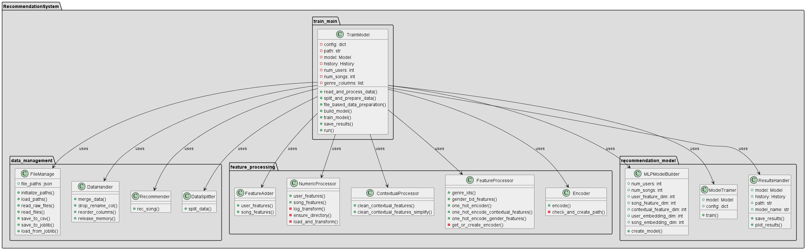
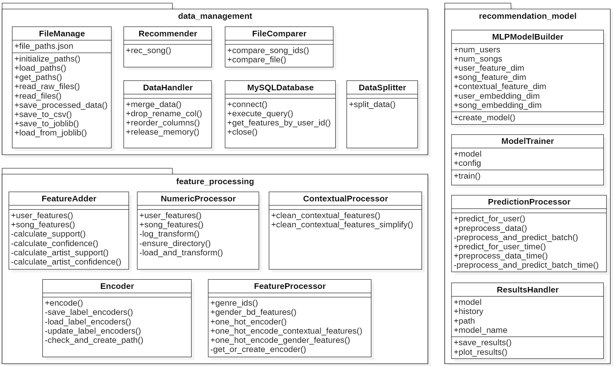

# Music Recommendation System

This repository contains the code for a music recommendation system built using TensorFlow and Keras. The project involves data preprocessing, model training, and prediction of recommendations based on user and song features.

## Table of Contents
- [Overview](#overview)
- [Architectures](#architectures)
- [Environment Setup](#environment-setup)
  - [Prerequisites](#prerequisites)
  - [Installation](#installation)
  - [Configuration](#configuration)
  - [Environment Verification](#environment-verification)
- [Usage](#usage)
  - [Training the Model](#training-the-model)
  - [Optional: Saving Model Architecture](#optional-saving-model-architecture)
  - [Making Predictions](#making-predictions)

## Overview

This project implements a Music Recommendation System using a `Multi-Layer Perceptron (MLP)`. The system processes raw user, song, and contextual data to train a model that predicts personalized song recommendations. Data is retrieved from a MySQL database, using user registration details, interaction context, and song features for generating accurate predictions.

### Training Model Architecture

<p align="center">
  
</p>

### Prediction Model Architecture

<p align="center">
  
</p>

### Function Structure

<p align="center">
  
</p>

## Environment Setup

### Prerequisites

- **Python Version**: The project is built using `Python 3.9 in a Conda virtual environment`. Ensure you have Conda installed, either through [Anaconda](https://www.anaconda.com/download/) or [Miniconda](https://docs.anaconda.com/miniconda/).

- **GPU**: Model training is accelerated using `CUDA 11.2 and cuDNN 8.1`. The author uses an NVIDIA GeForce GTX 1070 with 8GB VRAM, and it's recommended to have at least 8GB of VRAM for optimal performance.

- **TensorFlow Version**: `TensorFlow 2.6.0` is used, with support for GPU acceleration.

- **Other Dependencies**: All required packages are specified in the `environment.yml` file.

### Installation

Set up the project environment using a Conda YAML file to ensure compatibility and ease of use.

#### Steps:

1. Clone the repository:
   ```bash
   git clone https://github.com/01057150/project.git
   ```

2. Navigate to the project directory:
   ```bash
   cd project
   ```

3. Create a Conda environment from the YAML file and specify your custom environment name:
   ```bash
   conda env create -f environment.yml --name your_custom_env_name
   ```

4. Activate the environment:
   ```bash
   conda activate your_custom_env_name
   ```

**Note**: Replace `your_custom_env_name` with your desired environment name.

### Why Use Conda YAML File?

Using a Conda YAML file (`environment.yml`) is preferred because it:

- Ensures a consistent environment setup, including Python version and all necessary dependencies.
- Avoids the complexities and potential issues associated with managing dependencies via `requirements.txt`, especially when using both Conda and pip.
- Simplifies the process of recreating the exact environment on different systems.

## Configuration

### File Paths

The file paths for various data files are stored in the `file_paths.json` file located in the project root directory. Users can modify this file to match their environment without changing the code.

Here is an example of the `file_paths.json` structure with comments explaining each field:

```json
{
    # Paths to raw data files
    "train": "C:\\Users\\user\\Documents\\project\\train.csv",
    "songs": "C:\\Users\\user\\Documents\\project\\songs.csv",
    "members": "C:\\Users\\user\\Documents\\project\\members.csv",
    
    # Paths to encoded data files
    "context_data": "data/context_data.csv",
    "user_data": "data/user_data.csv",
    "song_data": "data/song_data.csv",
    "rec_song": "data/rec_song.csv",
    
    # Paths for train and test files
    "train_file": "D:\\project\\train_file.csv",
    "test_file": "D:\\project\\test_file_filtered.csv",
    
    # Directory for saving processed data
    "directory": "D:\\test"
}
```

### Obtaining Raw Data Files

The raw data files needed for this project can be obtained from the Kaggle competition [KKBox Music Recommendation Challenge](https://www.kaggle.com/c/kkbox-music-recommendation-challenge/data). You will need to download the datasets and adjust the file paths in `file_paths.json` to match the location where you save the files.

Make sure to place the downloaded files in the appropriate locations as specified in the `file_paths.json` to ensure the scripts can access them correctly.

### SQL Database Configuration

To connect to your MySQL database, create a `config.json` file in the project root directory with the following structure:

```json
{
    "user": "root",
    "password": "your_database_password",
    "host": "127.0.0.1",
    "database": "music_database"
}
```

Replace `"your_database_password"` with your actual MySQL password.

This configuration allows the scripts to connect to the database and retrieve necessary data for model training and prediction.

**Note:** For predictions, connecting to the database is optional. You can set `read_from_database` to `False` in the `prediction_main.py` script if you choose not to use the database.


### Environment Verification

To verify that your environment is correctly set up and the GPU is recognized, run the following script:

```bash
python check_environment.py
```

This script checks the availability of GPUs, CUDA, cuDNN, and the versions of TensorFlow, Keras, NumPy, Pandas, protobuf, and Python.

Example output:
```plaintext
Num GPUs Available: 1
GPU Devices: [PhysicalDevice(name='/physical_device:GPU:0', device_type='GPU')]
CUDA Version: 11.2
cuDNN Version: 8.0
TensorFlow version: 2.6.0
Keras version: 2.6.0
NumPy version: 1.23.3
Pandas version: 1.4.4
protobuf version: 3.17.2
Python version: 3.9.18
```
### Usage

### Training the Model

1. Configure your settings in the `config` dictionary in the `train_main.py` file.
2. Run the training script:
   ```bash
   python train_main.py
   ```

   The script will:
   - Read and process data from the raw files.
   - Split the data into training and validation sets.
   - Build and compile the MLP model.
   - Train the model and save the results.

   **Note:** For the best training performance, it's recommended to process the raw data directly by using:
   ```python
   recommender_model.run(use_train_file=False)
   ```
   This approach avoids potential precision loss due to data reloading. While setting `use_train_file=True` is useful for testing, the performance difference is usually minimal. For those prioritizing precision, it's advisable to avoid using the preprocessed training file.

### Optional: Saving Model Architecture

If you want to save the model architecture as an image, ensure the following:

1. Install the required packages:
   ```bash
   pip install pydot graphviz
   ```

2. Download and install Graphviz from the official website: [Graphviz Download](https://graphviz.org/download/).

3. Set the `save_architecture=True` when calling the `run` method in your training script:
   ```python
   recommender_model.run(save_architecture=True)
   ```

If you do not wish to save the model architecture, simply set `save_architecture=False` or omit the parameter when calling the method.

### Making Predictions

1. Ensure the trained model is available in the specified path (e.g., `model/model.h5`).
2. Run the prediction script:
   ```bash
   python predict_main.py
   ```

   The script will:
   - Load the model and the preprocessed song data.
   - Retrieve user and contextual data from the MySQL database.
   - Display the top recommendations for the specified user.


